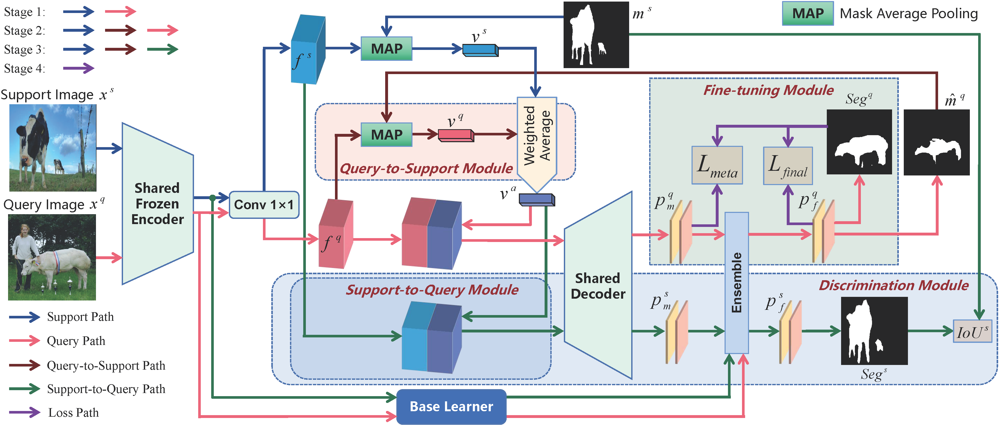

# An Efficient Fine-tuning Method for Few-Shot Segmentation

> **Abstract:** *Few-shot segmentation (FSS) aims to segment novel classes given a small number of labeled samples. Most of the existing studies do not fine-tune the model in meta testing, which biases the model towards the base classes and difficult to predict the novel classes. Other studies only use the support images for fine-tuning, which biases the model towards the support images rather than the target query images, especially when there is a large difference between the support and the query images. To alleviate these issues, we propose an efficient fine-tuning network (EFTNet) that uses the unlabeled query images and the pseudo labels to fine-tune the trained model parameters during meta-testing, which can bias the model towards the target query images. In addition, we design the queryto-support module, the support-to-query module, and the discrimination module to evaluate which fine-tuning round makes the model optimal. Moreover, the query-to-support module also takes the query images and their pseudo masks as part of the support images and support masks, which makes the prototypes contain query information and tend to get better predictions. Our method can be easily combined with existing studies and can greatly improve their models without redoing their meta-training phase. Plenty of experiments on PASCAL-5i and COCO-20i prove the effectiveness of our EFTNet. The EFTNet also achieves new state-of-the-art. Codes are in the supplemental material.*

  

### Dependencies

- RTX 3090
- Python 3.8
- PyTorch 1.12.0
- cuda 11.6
- torchvision 0.13.0
- tensorboardX 2.2

### Datasets

- PASCAL-5i:  [VOC2012](http://host.robots.ox.ac.uk/pascal/VOC/voc2012/) + [SBD](http://home.bharathh.info/pubs/codes/SBD/download.html)

- COCO-20i:  [COCO2014](https://cocodataset.org/#download)
- Put the datasets into the `EFTNet/data/` directory.
- Download the data lists from [BAM](https://github.com/chunbolang/BAM) and put them into the `EFTNet/lists` directory.
- Run `util/get_mulway_base_data.py` to generate base annotations and put them into the `EFTNet/data/base_annotation/` directory.

### Models

- Download the pre-trained backbones from [MSANet](https://github.com/AIVResearch/MSANet) and put them into the `EFTNet/initmodel` directory. 
- Download the trained base learners from [MSANet](https://github.com/AIVResearch/MSANet) and put them under `initmodel/PSPNet`. 
- Download the trained [MSANet](https://github.com/AIVResearch/MSANet) and put them into the `EFTNet/weights` directory.

### Scripts

- Change configuration and add weight path to `.yaml` files in `EFTNet/config` , then run the `meta_test.sh` file for testing.

### Performance

Performance comparison with the state-of-the-art approaches (*i.e.*, [MSANet](https://github.com/AIVResearch/MSANet), [BAM](https://github.com/chunbolang/BAM) in terms of **average** **mIoU** across all folds. 

1. ##### PASCAL-5i

   | Backbone  | Method      | 1-shot                   | 5-shot                   |
   | --------  | ----------- | ------------------------ | ------------------------ |
   | VGG16     | MSANet      | 65.76                    | 70.40                    |
   |           | EFTNet(ours)| 66.86 (+1.10) | 71.07 (+0.67) |
   | ResNet50  | MSANet      | 68.52                    | 72.60                    |
   |           | EFTNet(ours)| 70.01 (+1.49) | 73.64 (+1.04) |
   | ResNet101 | MSANet      | 69.13                    | 73.99                    |
   |           | EFTNet(ours)| 70.64 (+1.51) | 74.88 (+0.89) |

2. ##### COCO-20i

   | Backbone | Method      | 1-shot                   | 5-shot                   |
   | -------- | ----------- | ------------------------ | ------------------------ |
   | VGG16    | BAM         | 43.50                    | 49.34                    |
   |          | EFTNet(ours)| 48.13 (+4.63) | 53.28 (+3.94) |
   | ResNet50 | MSANet      | 48.03                    | 53.67                    |
   |          | EFTNet(ours)| 50.67 (+2.64) | 56.21 (+2.54) |
   | ResNet101| MSANet      | 51.09                    | 56.80                    |
   |          | EFTNet(ours)| 54.09 (+3.00) | 59.13 (+2.33) |
   

## References

This repo is mainly built based on [MSANet](https://github.com/AIVResearch/MSANet), [PFENet](https://github.com/dvlab-research/PFENet), and [BAM](https://github.com/chunbolang/BAM). Thanks for their great work!

